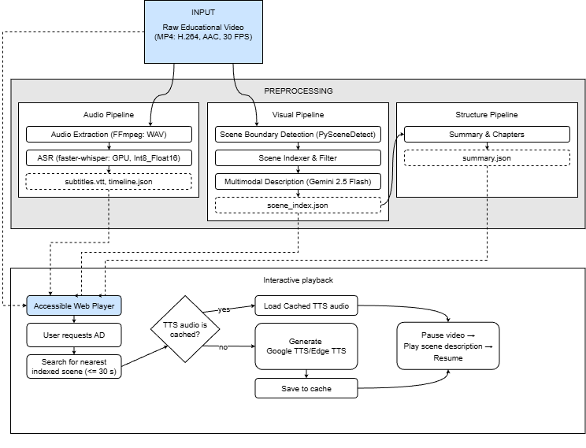

# Prototype

Reference document for the `Prototype` project.

Updated: **2026-04-07**

This document provides a verified, code-accurate description of the project.
It can be used for presentations, reports, or onboarding new contributors.

---

## 1. What This Project Is

`Prototype` is a **multistage multimodal pipeline** for improving
the accessibility of educational videos. The system takes a lecture, screencast,
or demonstration video and generates a set of artifacts used in a web player:

- accurate subtitles plus word-level timing data for interactive highlighting;
- a structured speech timeline;
- an index of key scenes with text descriptions;
- a summary and chapter markers;
- on-demand audio description for visually impaired users.

Core design principles:

- **do not embed descriptions into the video by default**;
- **pre-process text artifacts offline**;
- **synthesize audio description only on user request**;
- combine **service-backed** and **classical** processing in a single pipeline.

In practice this means two layers:

- **preprocessing layer**: CLI/API processes the video, writes artifacts, and persists `job_meta.json` state;
- **playback layer**: the Web UI does not re-process — it works with ready-made
  job artifacts served from `output/{job_id}` by the API.

Target user groups:

- students with hearing impairments;
- visually impaired users;
- students with ADHD or dyslexia;
- users who need better navigation through educational video content.

Supported languages in the current MVP:

- `en`
- `ru`

---

## 2. Where Specialized Models Are Used

The project is a **hybrid system** where specialized hosted or pretrained
components are used only where they provide clear value.

### 2.1. Service-Backed Components

| Area                         | Implementation                                                           | Input                      | Output                                    | Role                                   |
| ---------------------------- | ------------------------------------------------------------------------ | -------------------------- | ----------------------------------------- | -------------------------------------- |
| ASR                          | `faster-whisper` (`WhisperModel`)                                        | WAV audio                  | speech segments + `word-level timestamps` | Automatic speech recognition           |
| Multimodal scene description | hosted description service                                               | PNG frame + text prompt    | concise natural-language description      | Extracting meaning from visual content |
| Summary and chapters         | hosted summarization stage                                               | list of scene descriptions | `summary_points` + `chapters`             | Reducing cognitive load, navigation    |
| TTS                          | Google Cloud TTS (`Neural2` / `WaveNet`) or `edge-tts` (`Neural` voices) | description text           | MP3 audio                                 | Audio description synthesis            |

### 2.2. What Each Processing Component Does

#### A. Speech Recognition

File: `pipeline/audio/transcriber.py`

Uses a Whisper-family model via `faster-whisper`.
The project extracts not just text, but:

- detected language;
- speech segments;
- timestamps for **each word**;
- word-level confidence scores.

This enables:

- precise subtitles;
- karaoke-style word highlighting;
- ASR quality analysis;
- timeline export for APIs and UIs.

Current alignment level in the MVP:

- speech timing is available at the **word level** via Whisper timestamps;
- exported `subtitles.vtt` remains **segment-level** by default;
- phoneme alignment is not active unless MFA is explicitly enabled.

#### B. Visual Understanding

File: `pipeline/visual/descriptor.py`

For each key frame, the description stage is called.
The service receives the image directly and:

- reads any text on screen;
- understands the visual context;
- produces a brief description of a slide, diagram, demo, or interface.

This removes the need for a **separate OCR module**.

#### C. Summary and Chapter Generation

File: `pipeline/summary.py`

The second summary task operates not on pixels but on text descriptions
of scenes. The summarization stage receives a sequence of scenes like:

- `[30s] description`
- `[90s] description`
- `[150s] description`

and generates:

- 3–5 key summary points;
- 3–7 logical chapters with timestamps.

If the hosted service is unavailable, the project uses a fallback:
summary becomes a technical stub, and chapters are built from scenes
using simple rules.

#### D. Speech Synthesis

File: `pipeline/visual/tts.py`

Scene description text is converted to audio via:

- Google Cloud TTS with `Neural2`/`WaveNet` voices;
- `edge-tts`, which uses Microsoft neural voices.

In on-demand mode, audio is created **only on user request**
and then cached.

---

## 3. Non-Model Components

| Area                      | Implementation                    | Type                                 |
| ------------------------- | --------------------------------- | ------------------------------------ |
| Audio extraction          | `FFmpeg`                          | classical media processing           |
| Scene detection           | `PySceneDetect ContentDetector`   | classical frame-difference algorithm |
| Screencast fallback       | uniform sampling every 30 seconds | heuristic                            |
| Scene filtering           | min-interval + adaptive density   | rules                                |
| Word grouping by segments | midpoint-based matcher            | algorithm                            |
| REST API                  | `FastAPI`                         | backend infrastructure               |
| Web UI                    | `HTML/CSS/JS`                     | frontend                             |

Important notes:

- **MFA / phoneme alignment is not an active part of the system**;
- **there is no separate OCR in the project**;
- **scene detection is not neural** — it uses `ContentDetector`.

---

## 4. Current Pipeline Functionality

### 4.1. `on-demand`

This is the active and only supported runtime scenario of the project.

Steps:

1. audio is extracted from the video;
2. audio is transcribed via Whisper;
3. word-level timing and optional phoneme data are prepared for export;
4. if visual processing is enabled, key scenes are detected and indexed;
5. if scenes exist, scene descriptions and the summary/chapter output are built;
6. `subtitles.vtt`, `timeline.json`, and `job_meta.json` are written to `output/{job_id}`;
7. during playback, the user clicks the description button;
8. the API finds the nearest indexed scene and synthesizes TTS on demand;
9. the MP3 is cached under the job directory for future requests.

Key points:

- the video **is not modified**;
- TTS **is not run for all scenes upfront**;
- subtitle timecodes remain original;
- the user decides when they need an audio description.

---

## 5. System Architecture

### 5.1. Audio Branch

Files:

- `pipeline/audio/extractor.py`
- `pipeline/audio/transcriber.py`
- `pipeline/audio/aligner.py`

Active functions:

- `extract_audio()`
- `transcribe()`

`aligner.py` exists but with `settings.use_mfa = False` it returns an empty
phoneme list and functions as a stub.

### 5.2. Visual Branch

Files:

- `pipeline/visual/scene_detect.py`
- `pipeline/visual/scene_indexer.py`
- `pipeline/visual/descriptor.py`
- `pipeline/visual/tts.py`

Logic:

- `detect_scenes()` finds visual changes;
- if fewer than 3 scenes are found, **uniform temporal sampling** every 30 seconds activates;
- `build_scene_index()` filters scenes:
  - minimum interval between scenes: `5.0s`;
  - adaptive density (no hard cap);
- `generate_description()` creates descriptions via the description stage;
- `synthesize_speech_async()` creates TTS only on demand.

### 5.3. Summary and Chapters

File:

- `pipeline/summary.py`

If the hosted service is unavailable, summary does not disappear entirely —
the project builds fallback chapters from scenes.

### 5.4. Export and Integration

Files:

- `pipeline/exporters/vtt.py`
- `pipeline/exporters/json_export.py`
- `pipeline/word_grouper.py`
- `api/server.py`
- `static/index.html`

Integration flow:

- `main.py` writes artifacts into `output/{job_id}` and updates `job_meta.json` as the persistent state record;
- `api/server.py` reads those files back without recomputing the pipeline;
- optional artifacts (`scene_index.json`, `summary.json`, cached TTS MP3 files) are exposed only when they exist.

---

## 6. Generated Artifacts

### 6.1. Main Artifacts

| File               | Contents                                                                          | When Created                                             |
| ------------------ | --------------------------------------------------------------------------------- | -------------------------------------------------------- |
| `subtitles.vtt`    | subtitles by speech segment                                                       | always                                                   |
| `timeline.json`    | `language`, `detected_language`, `segments`, `words`, `phonemes`, `visual_events` | always                                                   |
| `scene_index.json` | scene index with descriptions                                                     | when the visual pipeline is enabled and scenes are found |
| `summary.json`     | summary points and chapter markers                                                | when `scene_index.json` exists                           |
| `job_meta.json`    | job metadata: requested language, detected language, and processing stats         | always                                                   |

### 6.2. `scene_index.json` Structure

Exported fields:

- `scene_id`
- `time`
- `description`
- `tts_cached`

`scene_index.json` stores **neither frames nor audio** — only a reusable
index of descriptions.

### 6.3. `timeline.json` Structure

Exported fields:

- `language`
- `detected_language`
- `segments`
- `words`
- `phonemes`
- `visual_events`

- `language` is the pipeline/output language used by the UI and TTS;
- `detected_language` preserves what Whisper reported during ASR;
- `visual_events` contains described scene events when the visual pipeline runs;
- `visual_events` is empty only if visual processing is skipped or no scenes are found;
- timecodes correspond to the original video.

---

## 7. Key Implementation Files

| What to check             | File                                  |
| ------------------------- | ------------------------------------- |
| Pipeline orchestration    | `main.py`                             |
| Global configuration      | `core/config.py`                      |
| Speech recognition        | `pipeline/audio/transcriber.py`       |
| MFA stub                  | `pipeline/audio/aligner.py`           |
| Scene detection           | `pipeline/visual/scene_detect.py`     |
| Description generation    | `pipeline/visual/descriptor.py`       |
| TTS                       | `pipeline/visual/tts.py`              |
| Summary and chapters      | `pipeline/summary.py`                 |
| Word grouping for karaoke | `pipeline/word_grouper.py`            |
| REST API                  | `api/server.py`                       |
| Web UI                    | `static/index.html`                   |
| Corpus evaluation         | `tests/evaluation/run_corpus_eval.py` |

---

## 8. API and User-Facing Functions

### 8.1. API Routes

Important: `POST /process` accepts a **local file path** (`video_path`)
that already exists on the same machine where the server runs. This is not
a browser upload endpoint.

Public routes:

- `POST /process`
- `GET /jobs`
- `GET /jobs/{job_id}/meta`
- `GET /jobs/{job_id}/scenes`
- `POST /jobs/{job_id}/describe`
- `GET /jobs/{job_id}/tts/{scene_id}`
- `GET /jobs/{job_id}/summary`
- `GET /jobs/{job_id}/video`
- `GET /jobs/{job_id}/subtitles`
- `GET /jobs/{job_id}/words`
- `GET /health`
- `GET /`

Important contract nuance:

- `/jobs/{job_id}/subtitles` returns segment-level WebVTT;
- `/jobs/{job_id}/words` returns the word-level timing data used by the Web UI overlay;
- `job_meta.json` and `/jobs` keep the requested/output language stable and expose the ASR-detected language separately.

Legacy compatibility route:

- `POST /process_video` (deprecated)

### 8.2. Web UI Features

Implemented features:

- select a processed video from the jobs list;
- play the original video;
- word-by-word subtitle highlighting;
- toggle between word-by-word and standard subtitle modes;
- summary tab;
- chapters tab;
- list of all scenes;
- on-demand scene description;
- TTS caching;
- high contrast mode;
- dyslexia-friendly font (`OpenDyslexic`);
- font size adjustment;
- wide line spacing;
- playback speed `0.5x–2x`;
- keyboard shortcuts:
  - `D` — request scene description;
  - `S` — stop audio description;
- `aria-live`, `role`, `tabindex`, `focus-visible`.

### 8.3. Subtitle Rendering

The project does not rely on the browser's standard subtitle rendering.
Instead:

- VTT is used as a data source;
- the browser's `<track>` is hidden;
- a custom overlay is drawn on top of the video;
- word highlight updates run via `requestAnimationFrame`.

This enables displaying states:

- current word;
- previous word;
- already spoken words;
- upcoming words.

---

## 9. Evaluation System

The project uses a structured approach to results evaluation, replacing
subjective user studies with a reproducible technical benchmark.

### 9.1. Report Structure

All results are saved in the `evaluation/` directory. Each run of
`run_corpus_eval.py` creates a new numbered subdirectory (e.g.,
`run_001`, `run_002`), enabling progress tracking across parameter changes.

Each directory contains:

- `per_video_metrics.csv` — per-video detail;
- `aggregate_metrics.csv` — summary statistics by language and content type;
- `baseline_comparison.csv` — B0 (ASR-only) vs B1 (Full Pipeline) comparison;
- `evaluation_report.json` — finalized report for publications.

### 9.2. Benchmark Methodology (Bilingual Multimodal Corpus)

The corpus consists of **24 videos** (12 EN, 12 RU), balanced by:

- **Duration**: short, medium, long;
- **Content type**: talking_head, slide-centric, screencast, practical_demo.
- **Matrix**: 2 languages × 3 duration buckets × 4 content types.

`evaluation/corpus_manifest.csv` is the source of truth for the current corpus.

Key measured parameters:

1. **RTF (Real-Time Factor)** — processing speed (target < 1.0);
2. **Coverage 15s** — visual description availability at any point in time;
3. **ASR Confidence** — subtitle reliability.

---

## 10. Design Decisions

- **Adaptive Scene Density**: the system is not limited to a fixed number of scenes.
  Scene count adapts to the visual complexity of the content.
- **Fallbacks**: for low-dynamics videos (screencasts), adaptive temporal sampling
  (Uniform Sampling) is used, guaranteeing "visual anchors" even without explicit
  scene changes.
- **JIT Synthesis**: TTS is generated on-demand and cached, conserving compute
  resources and API quotas.
- **Hybrid Architecture**: model-backed components handle cognitively complex
  tasks (ASR, visual understanding, summarization, TTS), while scene detection,
  media processing, word grouping, and infrastructure use classical algorithms.

---

## 11. How to Explain the Project

Recommended formulation:

> The project uses specialized models selectively — at key cognitively complex
> stages: speech recognition, visual content understanding, structured summary
> generation, and speech synthesis. The remaining stages use classical algorithms
> and engineering logic. Therefore, the system is a hybrid multimodal architecture,
> not a monolithic processing stack.

Key talking points:

1. **Where model-backed processing adds value**
   - ASR turns audio into precise text with timestamps.
   - The description stage turns a frame into a meaningful description.
   - The summary stage turns a set of scenes into summary and chapters.
   - TTS turns description text into audio for visually impaired users.

2. **Why not everything is model-backed**
   - scene detection is cheaper and more stable on classical methods;
   - FFmpeg handles audio extraction and rendering better;
   - API, UI, and timeline logic are engineering orchestration layers.

3. **Why this is a strong applied case**
   - integrates multiple processing components in a real working system;
   - solves a practical accessibility problem;
   - has measurable results, not just an idea.

---

## 12. Project in One Paragraph

> `Prototype` is an educational video preprocessing system for accessibility.
> It uses specialized services and pretrained models for speech recognition,
> key-scene description, summary/chapter generation, and audio description
> synthesis. Scene detection, video processing, word grouping, the API, and
> the web player are implemented with classical algorithms and engineering
> logic. The result is a system that combines model-backed processing and
> conventional software in a single accessible video player.
